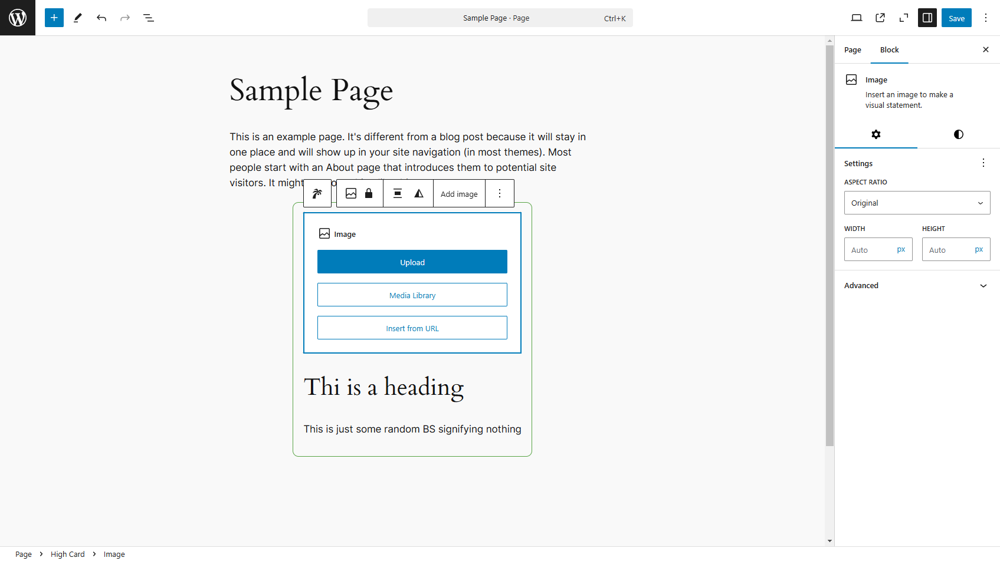
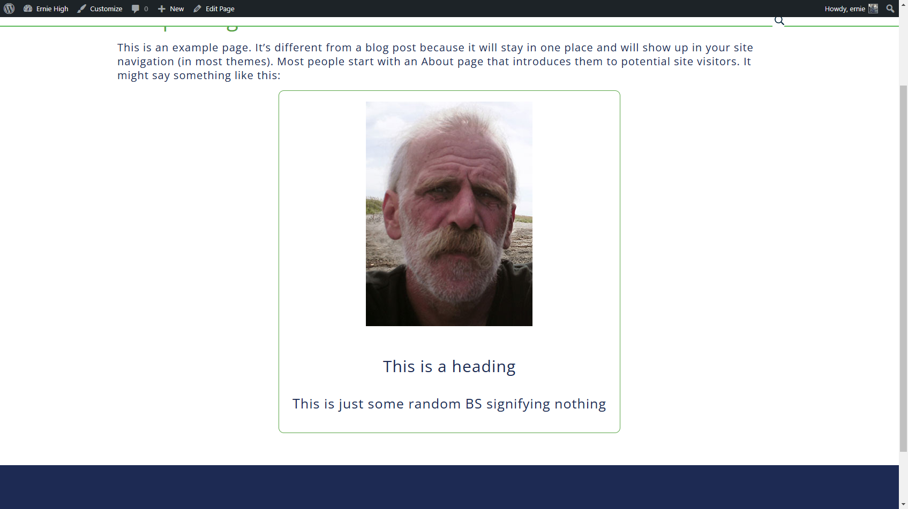

# High Card 

This is custom WordPress Gutenberg block for creating a "card" It is nothing fancy, using [the basic coding from WordPress ](https://developer.wordpress.org/block-editor/getting-started/tutorial)

A look at it in the standard page editor 

Then a look at it on the frontend 

For a live view go [here](https://ernieshigh.dev/sample/high-card)
